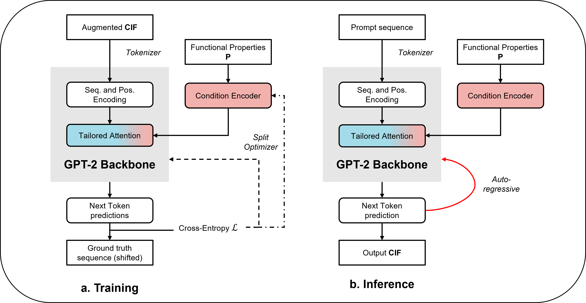
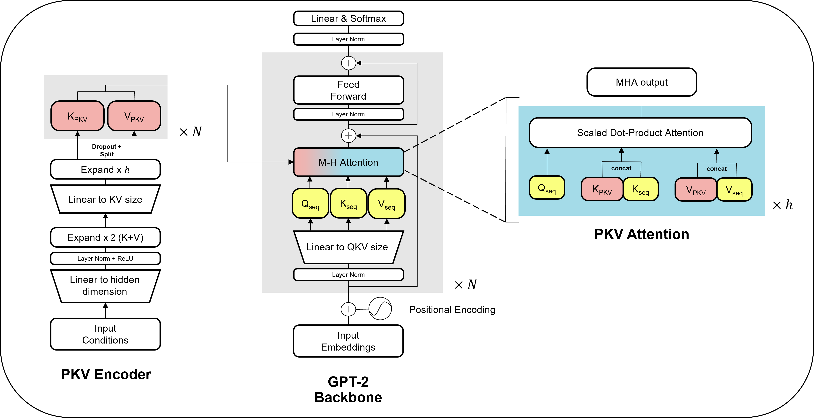

<div align="center">

<h1> CrystaLLM 2.0 </h1>
  <p>
    <strong>A Transformer-based model for property-guided crystal structure generation
    </strong>
  </p>
</div>

<p align="center">
<a href="https://huggingface.co/c-bone">
    
</a>
 <a href="https://www.nature.com/articles/s41467-024-54639-7">
     
 </a>
 <a href="https://github.com/C-Bone-UCL/CrystaLLM-2.0/blob/main/LICENSE">
     
 </a>
</p>

# Overview

CrystaLLM 2.0 is a Transformer-based system for generating crystalline structures as CIF files. It supports both unconditional generation and four conditional architectures that can generate structures based on target properties like bandgap, density, photovoltaic efficiency and XRD patterns.

<div align="center">

</div>

## Key Features

- **Unconditional Generation**: Generate crystal structures from structural/composition priors
- **Property-Guided Generation**: Generate crystal structures conditioned on target properties + structural priors
- **Multiple Architectures**: Choose from PKV, Prepend, Slider, Raw conditional methods plus unconditional base model
- **Flexible Conditioning**: You can use any set of numerical properties to condition, and one of the models handles heterogeneous datasets (some propeerties are missing in the dataet but not others...)
- **Evaluation of output structures**: Scripts for validity, uniqueness, novelty and stability metrics
- **HuggingFace Integration**: Pre-trained models available on HF Hub

## Table of Contents

- [Installation](#installation)
- [Model Types](#model-types)
- [Quick Start](#quick-start)
- [Training from Scratch](#training-from-scratch)
- [API](#api)
- [Studies](#studies)
- [License](#license)
- [Contact](#contact)

<br>

# Installation

## Prerequisites

- Python 3.10+
- PyTorch 2.1+
- Conda for environment management
- Hugging Face ans Weights & Biases accounts should be set up
- (Optional) CUDA-compatible GPU


## Setup

```bash
# Clone the repository
git clone https://github.com/C-Bone-UCL/CrystaLLM-2.0.git
cd CrystaLLMv2

# Create virtual environment
conda create -n CrystaLLMv2_env python=3.10
conda activate CrystaLLMv2_env

# Install dependencies and setup package
pip install -r requirements.txt
# material-hasher package needs to be installed via
pip install git+https://github.com/lematerial/material-hasher.git
# Install CrystaLLM 2.0 in editable mode
pip install -e .
```

### Optional: ALIGNN Environment Setup

For property prediction (bandgap), set up a separate environment to avoid dependency conflicts:

```bash
conda create -n alignn_env python=3.10
conda activate alignn_env
pip install dgl -f https://data.dgl.ai/wheels/torch-2.1/cu121/repo.html
pip install -r requirements-alignn.txt
```

### API Keys Configuration

Create `API_keys.jsonc` in the root directory for HuggingFace and Weights & Biases integration:

```jsonc
// filepath: API_keys.jsonc
{
  "HF_key": "your_hf_key_here", // Hugging Face token
  "wandb_key": "your_wandb_api_key_here" // Weights & Biases key
}
```
<br>

# Model Types

CrystaLLM 2.0 supports one unconditional and four conditional model architectures, allowing for both standard and property-driven generation. The desired model can be selected during training using the `--activate_conditionality` flag.

### 1. Unconditional CrystaLLM
Do not set the `--activate_conditionality` flag.

Standard CrystaLLM/GPT-2 architecture for generative tasks. Learns underlying patterns and grammar of CIF files without explicit property guidance.

### 2. Conditional Models

#### a. PKV-GPT 
`--activate_conditionality="PKV"`

Injects property information directly into the attention mechanism's past key-values. This allows the model to steer generation based on desired properties by concatenating conditional embeddings at each transformer layer. Provides strong conditioning while maintaining straightforward implementation. Based on ghost tokens from the [Prefix Tuning Paper](https://arxiv.org/abs/2101.00190).

<div align="center">

</div>

#### b. Slider-GPT 
`--activate_conditionality="Slider"`

Novel architecture where conditioning information is dynamically injected into each attention block via a 'slider' mechanism. Features two separate attention mechanisms at every token generation: one for main text and one for conditions. Attention scores are combined via weighted sum. Handles missing or unspecified conditions seamlessly with softer conditioning (weight initialized at 0 during finetuning).

<div align="center">

</div>

<details>
<summary> Prepend and Raw model details (comparative baselines used in paper) </summary>

#### c. Prepend-GPT 
`--activate_conditionality="Prepend"`

Prepends learned embeddings (soft prompts) to the input sequence. These prefix tokens represent desired conditional properties to guide model output. Provides strong conditioning with straightforward implementation but less flexibility than attention-based methods.

#### d. Raw-GPT 
`--activate_conditionality="Raw"`

Baseline approach where numerical condition values are converted to text and appended to input prompts. Requires no architectural changes but increases sequence length. Implemented for comparison but generally less performant.

</details>
<br>
<br>

# Quick Start

Use with pre-trained models from HuggingFace Hub for direct crystal structure generation. The `_load_and_generate.py` script handles downloading models to generating valid CIF structures with desired properties.

## How It Works

The script automatically:
1. **Downloads models** from HuggingFace Hub (cached locally after first use)
2. **Normalizes property values** - provide real-world values (e.g., bandgap in eV, density in g/cm³) 
3. **Creates prompts** at different detail levels (no composition, composition only, composition + space group)
4. **Generates structures** using the specified conditional model architecture
5. **Default Model** is set to the PKV model if not specified

Each model can be used with **manual generation** (specify compositions + properties) or **dataframe input** (pre-made prompts), except XRD models which currently require prepared dataframes.

## Available Pre-trained Models

- `c-bone/CrystaLLM-2.0_base`: Unconditional generation - Base model
- `c-bone/CrystaLLM-2.0_SLME`: Solar efficiency conditioning (0-33% range) - PKV model
- `c-bone/CrystaLLM-2.0_bandgap`: Bandgap + stability conditioning (0-18 eV, 0-5 eV/atom) - PKV model
- `c-bone/CrystaLLM-2.0_density`: Density + stability conditioning (0-25 g/cm³, 0-0.1 eV/atom) - PKV model
- `c-bone/CrystaLLM-2.0_COD-XRD`: XRD pattern conditioning (XRD requires dataframe input) - Slider model

> For XRD conditioning, you need the diffraction pattern taken with CuKα wavelength (2θ range 0-90°) and associated intensities. Currently need to manually pick out up to 20 most intense peaks which serve as conditioning information.

<details>
<summary> Expand for a non-exhaustive list of how you can generate with the models using the script </summary>

## Generation Examples

**Unconditional Generation**

Generate Ti2O4 structures with composition + spacegroup level prompts.

```bash
python _load_and_generate.py \
    --hf_model_path "c-bone/CrystaLLM-2.0_base" \
    --model_type "Base" \
    --manual \
    --compositions "Ti2O4" \
    --spacegroups "P4_2/mnm" \
    --level level_4 \
    --num_return_sequences 5 \
    --max_return_attempts 10 \
    --output_parquet generated_structures.parquet
```

**Bandgap Conditioning**

Generate structures with target 1.8 eV bandgap and stability. Uses cartesian mode to create all combinations of conditions for each composition.

```bash
python _load_and_generate.py \
    --hf_model_path "c-bone/CrystaLLM-2.0_bandgap" \
    --manual \
    --compositions "Ti2O4,Ti4O8" \
    --condition_lists "1.8" "0.0" \
    --level level_4 \
    --mode cartesian \
    --num_return_sequences 5 \
    --max_return_attempts 10 \
    --output_parquet generated_structures.parquet
```

**Density Conditioning**

Generate silica polymorphs with specific target densities. Uses paired mode for 1:1 composition-density mapping.

```bash
python _load_and_generate.py \
    --hf_model_path "c-bone/CrystaLLM-2.0_density" \
    --manual \
    --compositions "Si4O8,Si6O12,Si8O16" \
    --condition_lists "2.143,0.0" "1.842,0.0" "1.796,0.0" \
    --level level_2 \
    --mode paired \
    --num_return_sequences 5 \
    --output_parquet high_density_materials.parquet
```

**Solar Efficiency**

Screen multiple compositions at fixed SLME target. Uses broadcast mode to apply same conditions to all compositions.

```bash
python _load_and_generate.py \
    --hf_model_path "c-bone/CrystaLLM-2.0_SLME" \
    --manual \
    --compositions "CsPbI3,MAPbI3,FAPbI3" \
    --condition_lists "25.0" \
    --level level_2 \
    --mode broadcast \
    --num_return_sequences 5 \
    --output_parquet solar_screening.parquet
```

**XRD from Dataframe**

Generate from pre-processed XRD patterns. Requires prepared dataframe with XRD peak data.

```bash
python _load_and_generate.py \
    --hf_model_path "c-bone/CrystaLLM-2.0_COD-XRD" \
    --model_type "Slider" \
    --input_parquet "xrd_processed_prompts.parquet" \
    --num_return_sequences 5 \
    --output_parquet generated_structures.parquet
```

> **XRD Processing**: See `notebooks/X_XRD_COD.ipynb` for preparing XRD dataframes.

## Configuration Options

**Prompt levels `--level`:**
- `level_1`: Minimal (unconditional generation)
- `level_2`: Composition only (default)
- `level_3`: Composition + atomic properties  
- `level_4`: Composition + spacegroup

**Composition-Condition Pairing modes `--mode`:**
- `cartesian` (default): All combinations of compositions × conditions
- `paired`: 1:1 mapping (equal number of compositions and condition_lists required)
- `broadcast`: Single condition_list applied to all compositions

</details>
<br>
<br>

# Training, Generating & Evaluating from Scratch

Complete pipeline for training your own models from data preprocessing to evaluation. All training and generting parameters and options are defined in [`_args.py`](_args.py). Training & Generating should be done via configuration files (`.jsonc` format) which specify all necessary parameters.

## Data Processing Pipeline

### Step 1: Data Preparation (**Required**)

Input data should be a pandas DataFrame saved as Parquet file. To train a model you should save a dataframe to a parquet file which contains:

**Required columns:**
- `Database`: Source database name
- `Reduced Formula`: Standard reduced chemical formula
- `CIF`: Crystallographic structure in CIF format

**For structure recovery benchmarks**
- `Material ID`: Database identifier required for structure recovery benchmarks

**Optional columns:**
- `<Property Columns>`: Target properties (e.g., "Bandgap (eV)", "Density (g/cm^3)")
- `condition_vector`: Pre-computed condition vectors (for XRD studies)

### Step 2: Deduplication and Filtering (Optional)

**Script:** `_utils/_preprocessing/_deduplicate.py` - Removes duplicate structures and filters invalid entries based on chemical formula and space group, keeping the structure with lowest volume per formula unit.

<details>
<summary> Example Usage and Args </summary>

```bash
python _utils/_preprocessing/_deduplicate.py \
  --input_file /path/to/raw_data.parquet \
  --output_parquet /path/to/deduplicated_data.parquet \
  --property_columns "['Bandgap (eV)', 'Density (g/cm^3)']" \
  --filter_na_columns "['Bandgap (eV)']" \
  --filter_zero_columns "['Density (g/cm^3)']" \
  --filter_negative_columns "['Bandgap (eV)']"
```

**Key arguments:**
- `--filter_na_columns`: Remove entries with N/A or NaN values
- `--filter_zero_columns`: Remove entries with zero values  
- `--filter_negative_columns`: Remove entries with negative values

</details>

### Step 3: CIF Cleaning and Normalization (**Required**)

**Script:** `_utils/_preprocessing/_cleaning.py` - Standardizes CIF format and normalizes properties for stable training. Adds atomic property blocks, rounds numerical values, and applies variable brackets.

<details>
<summary> Example Usage and Args </summary>

```bash
python _utils/_preprocessing/_cleaning.py \
  --input_parquet /path/to/deduplicated_data.parquet \
  --output_parquet /path/to/cleaned_data.parquet \
  --num_workers 8 \
  --property_columns "['Bandgap (eV)', 'Density (g/cm^3)']" \
  --property1_normaliser "power_log" \
  --property2_normaliser "linear"
```

> Tip: Keep a note somewhere of the lowest and highest property values for each property, so that later when you have a particular property target you can easily normalize it to the format the model expects.

**Key arguments:**
- `--property1_normaliser` / `--property2_normaliser`: Normalization methods (`linear`, `power_log`, `signed_log`, `log10`, `None`)
- `--make_disordered_ordered`: Convert disordered structures to ordered ones
- `--num_workers`: Number of parallel workers for processing

**Normalization methods:**
- `linear`: Simple min-max scaling to [0,1] range
- `power_log`: Power transformation ($\beta$=0.8) followed by logarithmic scaling for skewed distributions
- `signed_log`: Signed logarithmic transformation for handling negative values
- `log10`: Base-10 logarithmic scaling for properties spanning multiple orders of magnitude
- `None`: No normalization applied

</details>

### Step 4: Dataset Upload to HuggingFace (**Required**)

**Script:** `_utils/_preprocessing/_save_dataset_to_HF.py` - Converts to HuggingFace format with train/validation/test splits and uploads to HF Hub.

> Important: You need to make sure that the data trained on has been passed through CIF cleaning, a quick way to make sure is check whether the CIFs in your dataframe contain brackets. If they do then text should be ready for training.

<details>
<summary> Example Usage and Args </summary>

```bash
python _utils/_preprocessing/_save_dataset_to_HF.py \
  --input_parquet /path/to/processed_data.parquet \
  --output_parquet "your-dataset-name" \
  --test_size 0.1 \
  --valid_size 0.1 \
  --HF_username "your-username" \
  --save_hub \
  --save_local
```

**Key arguments:**
- `--duplicates`: Prevents data leakage by splitting on Material ID (optional)
- `--test_size` / `--valid_size`: Split ratios (set both to 0.0 for training-only)
- `--save_hub` / `--save_local`: Upload to HF Hub and/or save locally (specify at least one)

</details>
<br>

## Training

All training should be done via configuration files (`.jsonc` format). These files specify model architecture, hyperparameters, data paths, and training settings. See example configs in `_config_files/training/` and review [`_args.py`](_args.py) for all available parameters.

<details>
<summary> Base model training CLI example </summary>

### Base Model Pretraining

Train the unconditional base models from scratch:

```bash
python _train.py --config _config_files/training/unconditional/lematerial-small.jsonc
```

**Multi-GPU Training:**
```bash
torchrun --nproc_per_node=2 _train.py --config your_config.jsonc
```
</details>

<details>
<summary> Conditional finetuning CLI example </summary>

### Conditional Fine-tuning

Fine-tune pretrained base models for property-guided generation:

**Single GPU:**
```bash
python _train.py --config _config_files/training/conditional/ft-slme/slme_ft-PKV-opt.jsonc
```

**Multi-GPU:**
```bash
torchrun --nproc_per_node=2 _train.py --config _config_files/training/conditional/ft-slme/slme_ft-PKV-opt.jsonc
```

Loads pretrained weights as starting point (or trains from scratch), adds conditional architecture layers, and uses split optimizer with different learning rates for conditioning vs base layers.

</details>
<br>

## Advanced Generation Pipeline

### Step 1: Create Prompts

**Script:** `_utils/_generating/make_prompts.py` - Generate input prompts for conditional generation with different levels of structural information.

<details>
<summary> Examples of Prompt Construction and Args </summary>

**Manual Prompts:**
```bash
python _utils/_generating/make_prompts.py \
  --manual \
  --compositions "Na1Cl1,K2S1" \
  --condition_lists "0.2,0.5,1.0" "0.0" \
  --level "level_3" \
  --output_parquet "test_prompts.parquet"
```

**Automatic Prompts from Dataset:**
```bash
python _utils/_generating/make_prompts.py \
  --automatic \
  --HF_dataset "c-bone/mp_20_pxrd" \
  --split "test" \
  --level "level_2" \
  --condition_columns "Condition Vector" \
  --output_parquet "dataset_prompts.parquet"
```

**Prompt levels `--level`:**
- `level_1`: Minimal (unconditional generation)
- `level_2`: Composition only (default)
- `level_3`: Composition + atomic properties  
- `level_4`: Up to space group information

**Composition-Condition Pairing modes `--mode` (see quick start examples for details)**
- `cartesian`: Every condition set is applied to every composition when making prompts
- `paired`: Need the same amount of condition sets as compositions, they get paired up in respective orders
- `broadcast`: Need only 1 condition for any amount of compositions, applies the condition set to all the compositions


</details>


### Step 2: Generate CIFs

**Script:** `_utils/_generating/generate_CIFs.py` - Generate crystal structures from prompts using trained models.

<details>
<summary> Examples of CIF generation and Args </summary>

```bash
python _utils/_generating/generate_CIFs.py \
  --config _config_files/generation/pkv_generation.jsonc
```

> You can generate with arguments from CLI but its easier/recommended to feed the config file, for which you can find alot of examples in [`_config_files/generation`](_config_files/generation)

**Key generation settings:**
- **Temperature:** Controls randomness (default ~1.0, higher is more exploratory but higher chance of gibberish)
- **Top-p/Top-k:** Sampling parameters (typical: 0.95, 50)
- **scoring_mode:** if set to `None`, then we just generate sequences * attempts number of CIFs per Prompt/Condition pair. If set to `LOGP`, we use a perplexity based scoring method (See Note)
- **num_return_sequences:** Batch size for generation (adjust for GPU mem.)
- **max_return_attempts:** Total generation for each Prompt/Condition pair = max_return_attempts * num_return_sequences

> Perplexity Scoring (LOGP) method: For each generation which passes basic sensibility checks, we compute transition scores for the token sequence, calculating the perplexity score. Lower perplexity values indicate higher model confidence in the generated sequence according to its learned probability distribution. For each prompt, we continue generation attempts until obtaining `target_valid_cifs` number of CIFs that pass the sensibility checks (unless we reach the `max_attempts` number of attempts. Then the outputs are ranked by perplexity (given in an additional `Score` column) and we can filter to the most confident one for example.

</details>

### Step 3: Post-process

**Script:** `_utils/_generating/postprocess.py` - Clean and validate generated CIF structures.

<details>
<summary> Examples of postprocessing and Args </summary>

```bash
python _utils/_generating/postprocess.py \
  --input_parquet "generated_cifs.parquet" \
  --output_parquet "processed_cifs.parquet" \
  --num_workers 4
```

Applies space group symmetry operations, validates structure consistency, and computes basic properties (density, volume, reduced formulas).

</details>
<br>

## Evaluation

### VUN Metrics (Validity, Uniqueness, Novelty)

**Script:** `_utils/_metrics/VUN_metrics.py` - Essential metrics for assessing generation quality using structural analysis.

**Required:** Structures must be post-processed with Reduced Formulas column included 

**Metrics computed:**
- **Validity**: Structures with correct spacegroup, reasonable bond lengths, and consistent atom multiplicities
- **Uniqueness**: Distinct structures within the generated set (using BAWL hashing)
- **Novelty**: Structures not present in the reference dataset
- **Compositional Novelty**: Reduced Formula not present in reference dataset

<details>
<summary> Example Usage </summary>

```bash
python _utils/_metrics/VUN_metrics.py \
  --input_parquet generated_structures_processed.parquet \
  --huggingface_dataset "c-bone/mp_20" \
  --output_parquet vun_results.parquet \
  --num_workers 8
```

We can optionally set the `--check_comp_novelty` flag, which adds an `is_comp_novel` boolean column to the metrics dataframe.

</details>

### Energy Above Hull (Stability)

**Script:** `_utils/_metrics/mace_ehull.py` - Calculate thermodynamic stability using MACE energy predictions. See the [MACE paper](https://arxiv.org/abs/2206.07697) for details on the surrogate model.

> To calculate E$_{hull}$ - First, total energies are computed using the MACE-MP default calculator, predicted energies are then processed using the *MaterialsProject2020Compatibility* scheme to ensure consistency between GGA and GGA+U calculations. The surrogate energy predictions are compared to formation energies of known materials from the MP dataset and used to construct a convex hull. The energy above the convex hull (E$_{hull}$) quantifies thermodynamic stability by comparing a material’s formation energy to competing phases.

<details>
<summary> Example Usage and Args </summary>

```bash
python _utils/_metrics/mace_ehull.py \
  --post_parquet postprocessed_structures.parquet \
  --output_parquet stability_results.parquet \
  --num_workers 4
```

Lower E-hull values indicate higher thermodynamic stability. Structures with E-hull < 0.1 eV/atom are typically considered experimentally synthesizable. (We can extend to 0.157 eV/atom if we want to account for MAE in energy predictions of this MACE model)

</details>

### Additional Metrics

XRD, Bandgap, Density, and challenge set benchmark metrics available in `_utils/_metrics/` folder.

> **Note**: ALIGNN-based scripts require the separate `alignn_env` environment.

# API

Containerised API provides access to all CLI tools via REST endpoints.

<details>
<summary> Build and Run the CrystaLLM 2.0 API </summary>

## Build and Run Container

```bash
# Install NVIDIA Container Toolkit
distribution=$(. /etc/os-release;echo $ID$VERSION_ID)
curl -fsSL https://nvidia.github.io/libnvidia-container/gpgkey | sudo gpg --dearmor -o /usr/share/keyrings/nvidia-container-toolkit-keyring.gpg
curl -s -L https://nvidia.github.io/libnvidia-container/$distribution/libnvidia-container.list | \
    sed 's#deb https://#deb [signed-by=/usr/share/keyrings/nvidia-container-toolkit-keyring.gpg] https://#g' | \
    sudo tee /etc/apt/sources.list.d/nvidia-container-toolkit.list

sudo apt-get update
sudo apt-get install -y nvidia-container-toolkit
sudo systemctl restart docker

# Build the container
docker build -t crystallm-api .

# Create data directories
mkdir -p data outputs

# Run the container
docker run \
  -u $(id -u):$(id -g) \
  -p 8000:8000 \
  -v $(pwd)/data:/app/data \
  -v $(pwd)/outputs:/app/outputs \
  -e HF_KEY="your_hf_token_here" \
  -e WANDB_KEY="your_wandb_key_here" \
  --name crystallm-api \
  crystallm-api
```
</details>

<details>
<summary> Examples of API usage </summary>

## API Usage Examples

**Data Preprocessing:**
```bash
# Deduplicate data
curl -X POST "http://localhost:8000/preprocessing/deduplicate" \
  -H "Content-Type: application/json" \
  -d '{
    "input_file": "/app/data/raw_data.parquet",
    "output_parquet": "/app/data/deduplicated_data.parquet",
    "property_columns": "[\"Bandgap (eV)\", \"Density (g/cm^3)\"]"
  }'

# Clean and normalize
curl -X POST "http://localhost:8000/preprocessing/clean" \
  -H "Content-Type: application/json" \
  -d '{
    "input_parquet": "/app/data/deduplicated_data.parquet",
    "output_parquet": "/app/data/cleaned_data.parquet",
    "property1_normaliser": "power_log"
  }'
```

**Training:**
```bash
# Train model
curl -X POST "http://localhost:8000/train" \
  -H "Content-Type: application/json" \
  -d '{
    "config_file": "_config_files/cg_train/ft-slme/slme_ft-PKV.jsonc",
    "multi_gpu": false
  }'
```

**Generation:**
```bash
# Direct generation
curl -X POST "http://localhost:8000/generate/direct" \
  -H "Content-Type: application/json" \
  -d '{
    "hf_model_path": "c-bone/CrystaLLM-2.0_base",
    "compositions": "Ti2O4",
    "num_return_sequences": 5,
    "output_parquet": "/app/outputs/generated_structures.parquet"
  }'
```

**Evaluation:**
```bash
# VUN metrics
curl -X POST "http://localhost:8000/metrics/vun" \
  -H "Content-Type: application/json" \
  -d '{
    "gen_data": "/app/outputs/generated_structures.parquet",
    "huggingface_dataset": "c-bone/mp_20"
  }'
```

**Job Management:**
```bash
# Check job status
curl -X GET "http://localhost:8000/jobs/JOB_ID"

# List all jobs
curl -X GET "http://localhost:8000/jobs"
```

</details>
<br>

# Studies

Experimental notebooks demonstrating end-to-end pipelines are available in [`notebooks/`](notebooks/) with files starting with `X_`. 

Key examples:
- **mp-20 notebook**: Pipeline for structure recovery given desired theoretical XRD
- **SLME notebook**: Pipeline for discovery of a meterial with a desired photovoltaic

# License

This project is licensed under the MIT License. See the [LICENSE](LICENSE) file for details.

# Contact

For questions or support, please contact cyprien.bone.24@ucl.ac.uk or raise an issue on the GitHub page.
