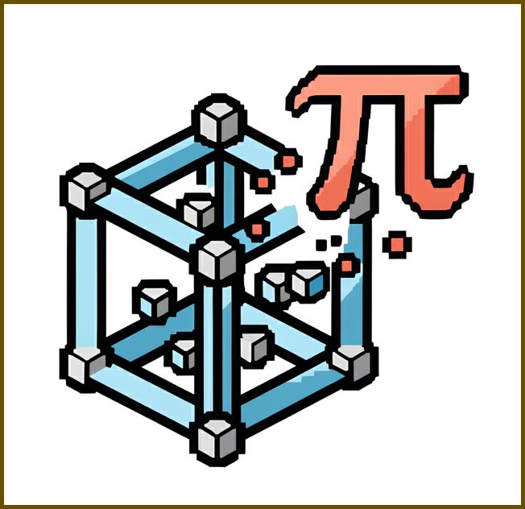
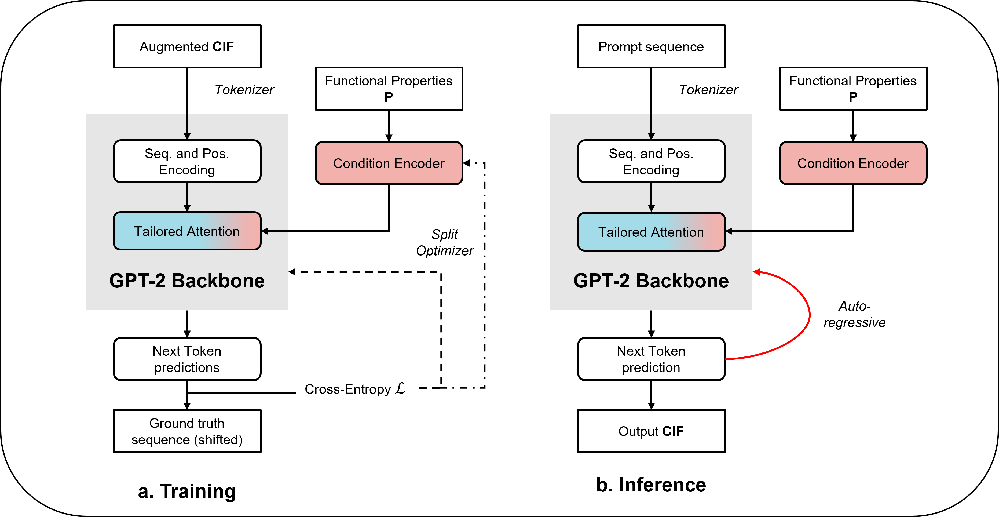

<div align="center">

<h1> CrystaLLM-<span style="font-size: 1.2em;">&pi; </span> (property injection) </h1>
  
  <p>
    <strong>A Transformer-based model for property-guided crystal structure generation
    </strong>
  </p>
</div>

<p align="center">
<a href="https://huggingface.co/c-bone">
    
</a>
<a href="https://huggingface.co/spaces/LeMaterial/LeMat-GenBench">
    
</a>
<a href="https://arxiv.org/pdf/2511.21299">
    
</a>
<a href="https://www.nature.com/articles/s41467-024-54639-7">
    
</a>
<a href="https://github.com/C-Bone-UCL/CrystaLLM-pi/blob/main/LICENSE">
    
</a>
<a href="https://github.com/C-Bone-UCL/CrystaLLM-pi/actions/workflows/ci.yml">
    
</a>
<a href="https://c-bone-ucl.github.io/CrystaLLM-pi/">
    
</a>

</p>

<br>

## Overview

CrystaLLM-<span style="font-size: 1.2em;">&pi;</span> generates crystal structures as CIF files, with optional targets such as bandgap, density, photovoltaic efficiency or XRD peaks. You can use a released model or fine-tune one on your own data.

<div align="center">

</div>

This repo includes the package, tutorials, documentation and a containerised API, with pretrained models available on Hugging Face. The API also powers the [CrystaLLM-<span style="font-size: 1.2em;">&pi;</span> web application](https://crystallm-pi.psdi.ac.uk/). Most models fit on a 16 GB GPU for training and need 1–2 GB for generation. Generation also runs on CPU.

## Reproducing the paper

The notebooks and configs for ["Discovery and recovery of crystalline materials with property-conditioned transformers"](https://arxiv.org/pdf/2511.21299) are in the repository made to reproduce our paper: [CrystaLLM-pi-paper](https://github.com/C-Bone-UCL/CrystaLLM-pi-paper).

Use this repo for up to date training, generation, and access to models from our other CrystaLLM-<span style="font-size: 1.2em;">&pi;</span>  projects as they come out!

> In the reproduce paper code, the `Residual` model goes buy `Slider`, and the `Prefix` model goes by `PKV`. This is legacy naming and has been updated across this codebase.

## Key Features

- **Structure generation**: generate CIFs from scratch or from a formula, with optional Z and space-group inputs.
- **Property targets**: guide generation with one or more numerical properties.
- **Fine-tuning**: train Prefix or Residual models on your own data. Residual models also support missing property values.
- **Evaluation**: check validity, uniqueness, novelty and stability.
- **Released models**: download pretrained models from Hugging Face and run them yourself.

## Documentation

Full documentation: **https://c-bone-ucl.github.io/CrystaLLM-pi/**, quick links:

- [Installation](https://c-bone-ucl.github.io/CrystaLLM-pi/install/)
- [Quickstart and generation examples](https://c-bone-ucl.github.io/CrystaLLM-pi/quickstart/)
- [Model types and conditioning mechanisms](https://c-bone-ucl.github.io/CrystaLLM-pi/models/)
- [Training, generating and evaluating from scratch](https://c-bone-ucl.github.io/CrystaLLM-pi/training/)
- [Virtual crystal generation](https://c-bone-ucl.github.io/CrystaLLM-pi/virtualiser/)
- [API service and Apptainer builds](https://c-bone-ucl.github.io/CrystaLLM-pi/api-service/)
- [Tutorial notebooks and tokenizer customisation](https://c-bone-ucl.github.io/CrystaLLM-pi/tutorials/)
- [API reference](https://c-bone-ucl.github.io/CrystaLLM-pi/api/cli/)
- [Contributing](docs/CONTRIBUTING.md) and [Code of conduct](docs/CODE_OF_CONDUCT.md)

## Installation

```bash
git clone https://github.com/C-Bone-UCL/CrystaLLM-pi.git
cd CrystaLLM-pi
uv sync --extra all
source .venv/bin/activate
```

See the [installation page](https://c-bone-ucl.github.io/CrystaLLM-pi/install/) for prerequisites, installing uv, lighter installs and API key setup.

## Quick Start

Use with pre-trained models from HuggingFace Hub for direct crystal structure generation. The `_load_and_generate.py` script handles downloading models and generating valid CIF structures with desired properties.

> **Note**: Properties (Conditions, Spacegroups, XRD files, Z values) map strictly 1:1 to the reduced formulas provided in `--reduced_formula_list`.
> 
> **Outputs**: Outputs can either be saved as a dataframe in a `.parquet` using the `--output_parquet` flag, or as individual CIFs in a directory using the `--output_cif_dir` flag.

**Recovery: known composition and space group, no property**

Generate Ti2O4 (TiO2 with Z=2) in space group P4_2/mnm. The model samples up to 2 batches of 5 and keeps 5 valid structures.

```bash
python _load_and_generate.py \
    --hf_model_path "c-bone/CrystaLLM-pi_ft_alex_mp_20-text" \
    --reduced_formula_list "TiO2" \
    --z_list "2" \
    --spacegroups "P4_2/mnm" \
    --level level_4 \
    --num_return_sequences 5 \
    --max_return_attempts 2 \
    --target_valid_cifs 5 \
    --output_cif_dir recovery_cifs
```

**Discovery: property target only**

Generate structures with no composition given, asking the SLME model for a photovoltaic efficiency of 25%. The model chooses the elements, stoichiometry and space group, sampling up to 2 batches of 5 and keeping 5 valid structures.

```bash
python _load_and_generate.py \
    --hf_model_path "c-bone/CrystaLLM-pi_SLME" \
    --condition_lists "25.0" \
    --level level_1 \
    --num_return_sequences 5 \
    --max_return_attempts 2 \
    --target_valid_cifs 5 \
    --output_cif_dir discovery_cifs
```

To understand what each flag does and see more examples, see the documentation [quickstart page](https://c-bone-ucl.github.io/CrystaLLM-pi/quickstart/).

## Available Pre-trained Models

Each released model exists because a paper study or tutorial produced it. This table keeps track of all available models in the zoo as they come out. 

| Model | Class | Conditioning | Origin |
|---|---|---|---|
| `c-bone/CrystaLLM-pi_ft_alex_mp_20-text` | GPT-2 | unconditional | **Recommended base model**, LeMat-Bulk pretrain finetuned on Alex-MP-20 CIFs |
| `c-bone/CrystaLLM-pi_base` | GPT-2 | unconditional | LeMaterial base model from the first paper |
| `c-bone/CrystaLLM-pi_mp_20_base` | GPT-2 | unconditional | MP-20 text only model for LeMat-Bench|
| `c-bone/CrystaLLM-pi_alex_mp_20_base` | GPT-2 | unconditional | Alex-mp-20 text only model for LeMat-Bench |
| `c-bone/CrystaLLM-pi_SLME` | Prefix  | solar efficiency (SLME), 0-33% | SLME discovery study, maintained here in [`T4_SLME`](notebooks/T4_SLME.ipynb) |
| `c-bone/CrystaLLM-pi_bandgap` | Prefix | bandgap + stability, 0-18 eV / 0-5 eV/atom | Pretraining-benefits study ([B1a notebook](https://github.com/C-Bone-UCL/CrystaLLM-pi-paper/blob/main/notebooks/B1a_Pretrain_benefits.ipynb) in the paper repo) |
| `c-bone/CrystaLLM-pi_density` | Prefix  | density + stability, 0-25 g/cm3 / 0-0.1 eV/atom | Dataset-size study ([B2 notebook](https://github.com/C-Bone-UCL/CrystaLLM-pi-paper/blob/main/notebooks/B2_Dataset_size_study.ipynb) in the paper repo) |
| `c-bone/CrystaLLM-pi_Mattergen-XRD` | Residual | XRD peak-picked | XRD recovery studies ([X_XRD_* notebooks](https://github.com/C-Bone-UCL/CrystaLLM-pi-paper/tree/main/notebooks) in the paper repo) |
| `c-bone/CrystaLLM-pi_Chili100K-XRD` | Residual | XRD peak-picked | Model used in the paper's [CHILI-100K recovery study](https://github.com/C-Bone-UCL/CrystaLLM-pi-paper/blob/main/notebooks/X_XRD_chili100k.ipynb) in the paper repo |

Model metadata (class, conditions, normalization) lives in [`_utils/model_registry.json`](_utils/model_registry.json). To generate with a model that is not in the table, you just pass a JSON file with the same schema via `--model_registry`. [`notebooks/T1_finetune_density_example.ipynb`](notebooks/T1_finetune_density_example.ipynb) walks through that full loop (finetune a density model, upload it, register it, generate with it).

The conditioning mechanism behind each class is described on the [models page](https://c-bone-ucl.github.io/CrystaLLM-pi/models/).

## Tutorial Notebooks

Four notebooks in [`notebooks/`](notebooks/) cover the maintained workflows end to end:

* [`T1_finetune_density_example.ipynb`](notebooks/T1_finetune_density_example.ipynb): finetune a base model on your own property dataset, push it to the Hub, register it, and generate with it
* [`T2_load_and_generate.ipynb`](notebooks/T2_load_and_generate.ipynb): generate structures with the released Hub models (courtesy of [Joley Lin](https://github.com/yhjollin/))
* [`T3_API_density_example.ipynb`](notebooks/T3_API_density_example.ipynb): predict density for a composition through the containerised API
* [`T4_SLME.ipynb`](notebooks/T4_SLME.ipynb): discover a material with a target photovoltaic efficiency

Customising the tokenizer is covered on the [tutorials page](https://c-bone-ucl.github.io/CrystaLLM-pi/tutorials/).

## Citation

Please cite the following when using this work: ["Discovery and recovery of crystalline materials with property-conditioned transformers"](https://arxiv.org/pdf/2511.21299)

```
@misc{bone2026discoveryrecoverycrystallinematerials,
      title={Discovery and recovery of crystalline materials with property-conditioned transformers}, 
      author={Cyprien Bone and Matthew Walker and Bradley A. A. Martin and Kuangdai Leng and Luis M. Antunes and Ricardo Grau-Crespo and Amil Aligayev and Javier Dominguez and Keith T. Butler},
      year={2026},
      eprint={2511.21299},
      archivePrefix={arXiv},
      primaryClass={cond-mat.mtrl-sci},
      url={https://arxiv.org/abs/2511.21299}, 
}
```

## License

This project is licensed under the MIT License. See the [LICENSE](LICENSE) file for details.

## Contact

For questions or support, please contact cyprien.bone.24@ucl.ac.uk or raise an issue on the GitHub page.

## Acknowledgments
This work has been supported by UKRI funding (EP/Y000552/1 and EP/Y014405/1)
