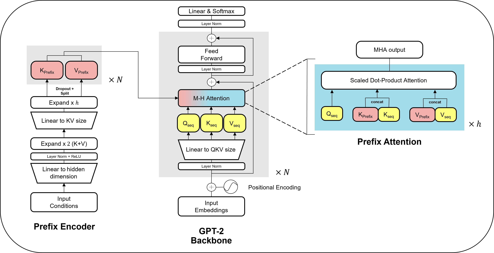
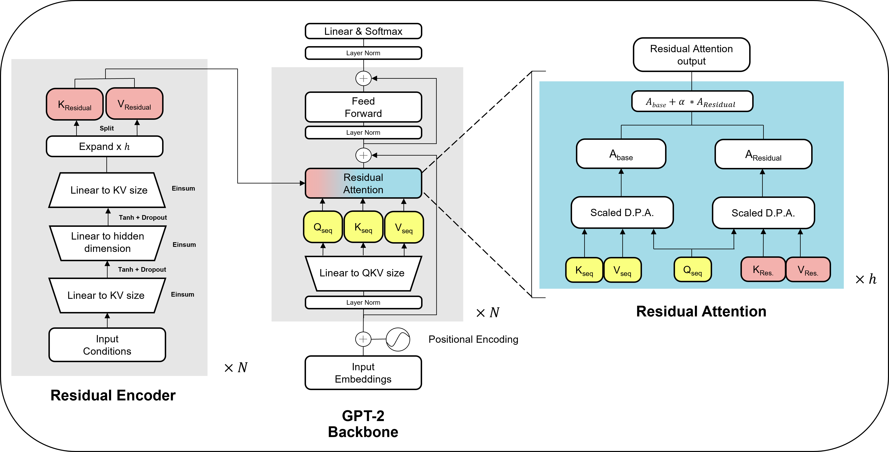

# Model Types

CrystaLLM-&pi; supports unconditional and conditional model architectures for standard and property-conditioned generation. Select the desired architecture during training with the `--activate_conditionality` flag.

### 1. Unconditional CrystaLLM

Do not set the `--activate_conditionality` flag.

This is the standard CrystaLLM/GPT-2 architecture. It learns the patterns and grammar of CIF files without explicit property conditioning.

### 2. Conditional Models

CrystaLLM-&pi; provides two mechanisms for incorporating property information. **Prefix** conditioning adds the conditioning information to the attention mechanism as cached key-values. **Residual** conditioning incorporates it into each attention block via a residual term which modulates the base attention. Both are selected using `--activate_conditionality`.

#### a. Prefix-GPT (Prefix Attention)

`--activate_conditionality="Prefix"`

Property information is injected into the attention mechanism through its past key-values. Conditional embeddings are added at each transformer layer, allowing generation to be guided towards specified properties. The approach is based on ghost tokens from the [Prefix Tuning Paper](https://arxiv.org/abs/2101.00190).

{ width="75%" style="background-color:white" }

#### b. Residual-GPT (Residual Attention)

`--activate_conditionality="Residual"`

Conditioning information is injected into each attention block through a slider mechanism. At each token generation step, separate attention mechanisms process the main text and conditioning information (using the same query), and their outputs are combined with a weighted sum. This also allows conditions to be omitted or left unspecified, resulting in softer conditioning.

{ width="75%" style="background-color:white" }

??? note "Paper-era checkpoints"
    Models released with the paper were trained with earlier implementations of the same two conditioning mechanisms. These are named `PKV` (prefix) and `Slider` (residual) in the code, and `Prefix attention` and `Residual attention` in the paper. They are loaded and used automatically based on the model name, so you can use them in the `_load_and_generate.py` script. The two generations remain separate classes because their weights are not interchangeable, since we made some minor improvements to the model internals. Training these legacy classes is disabled, and `--activate_conditionality="PKV"` or `"Slider"` raises an error pointing to the current implementations.

    > The paper also benchmarks two comparative baselines, Prepend-GPT and Raw-GPT. These are available in the reproduction repository [CrystaLLM-pi-paper](https://github.com/C-Bone-UCL/CrystaLLM-pi-paper).

 

## Available Pre-trained Models

Each released model exists because a paper study or tutorial produced it. This table keeps track of all available models in the zoo as they come out. 

| Model | Class | Conditioning | Origin |
|---|---|---|---|
| `c-bone/CrystaLLM-pi_ft_alex_mp_20-text` | GPT-2 | unconditional | **Recommended base model**, a LeMat-Bulk pretrained model fine-tuned on Alex-MP-20 CIFs |
| `c-bone/CrystaLLM-pi_base` | GPT-2 | unconditional | LeMat-Bulk base model from the first paper |
| `c-bone/CrystaLLM-pi_mp_20_base` | GPT-2 | unconditional | MP-20 text only model for LeMat-Bench|
| `c-bone/CrystaLLM-pi_alex_mp_20_base` | GPT-2 | unconditional | Alex-mp-20 text only model for LeMat-Bench |
| `c-bone/CrystaLLM-pi_SLME` | Prefix  | solar efficiency (SLME), 0-33% | SLME discovery study, maintained in [`T4_SLME`](https://github.com/C-Bone-UCL/CrystaLLM-pi/blob/main/notebooks/T4_SLME.ipynb) |
| `c-bone/CrystaLLM-pi_bandgap` | Prefix | bandgap + stability, 0-18 eV / 0-5 eV/atom | Pretraining-benefits study ([B1a notebook](https://github.com/C-Bone-UCL/CrystaLLM-pi-paper/blob/main/notebooks/B1a_Pretrain_benefits.ipynb) in the paper repository) |
| `c-bone/CrystaLLM-pi_density` | Prefix  | density + stability, 0-25 g/cm3 / 0-0.1 eV/atom | Dataset-size study ([B2 notebook](https://github.com/C-Bone-UCL/CrystaLLM-pi-paper/blob/main/notebooks/B2_Dataset_size_study.ipynb) in the paper repository) |
| `c-bone/CrystaLLM-pi_Mattergen-XRD` | Residual | XRD peak-picked | XRD recovery studies ([X_XRD_* notebooks](https://github.com/C-Bone-UCL/CrystaLLM-pi-paper/tree/main/notebooks) in the paper repository) |
| `c-bone/CrystaLLM-pi_Chili100K-XRD` | Residual | XRD peak-picked | CHILI-100K recovery study from the first paper [CHILI-100K notebook](https://github.com/C-Bone-UCL/CrystaLLM-pi-paper/blob/main/notebooks/X_XRD_chili100k.ipynb) |

Model metadata, including the model class, conditioning variables, and normalisation, is stored in [`_utils/model_registry.json`](https://github.com/C-Bone-UCL/CrystaLLM-pi/blob/main/_utils/model_registry.json). To generate with a model that is not listed above with the `_load_and_generate.py` script, provide a JSON file with the same schema through `--model_registry`. See [`notebooks/T1_finetune_density_example.ipynb`](https://github.com/C-Bone-UCL/CrystaLLM-pi/blob/main/notebooks/T1_finetune_density_example.ipynb) for complete workflow, from fine-tuning a density model to uploading, registering, and generating with it.

 